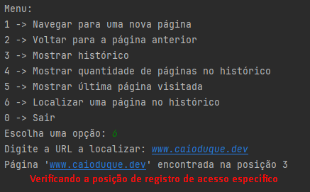

# Avaliação
- Este código todo é solução de uma avaliação da qual participei;
- Foi criada pelo Sr. Professor Marcelo Yamamoto.

## </O código>
- Com o objetivo de demonstrar como utilizar Pilhas para transitar e armazenar dados em variáveis;

---

# Exemplos!
- Confira abaixo alguns exemplos visuais da resposta do terminal durante o uso deste sistema:

### Exemplo 1:
- Como demonstrado abaixo, este é o exemplo 1 de uso do sistema:

---

### Exemplo 2:
- Como demonstrado abaixo, este é o exemplo 2 de uso do sistema:

---

### Exemplo 3:
- Como demonstrado abaixo, este é o exemplo 3 de uso do sistema:

---

### Exemplo 4:
- Como demonstrado abaixo, este é o exemplo 4 de uso do sistema:

---

### Exemplo 5:
- Como demonstrado abaixo, este é o exemplo 5 de uso do sistema:

---

### Exemplo 6:
- Como demonstrado abaixo, este é o exemplo 6 de uso do sistema:

---

### Exemplo 7:
- Como demonstrado abaixo, este é o exemplo 7 de uso do sistema:

